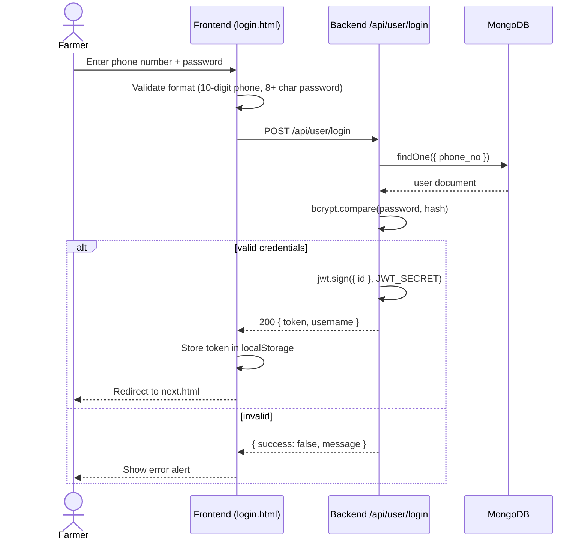
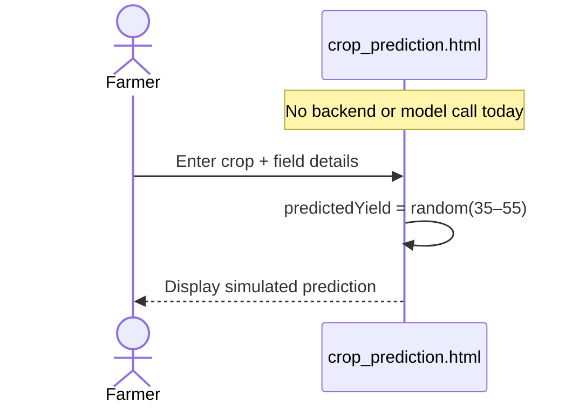
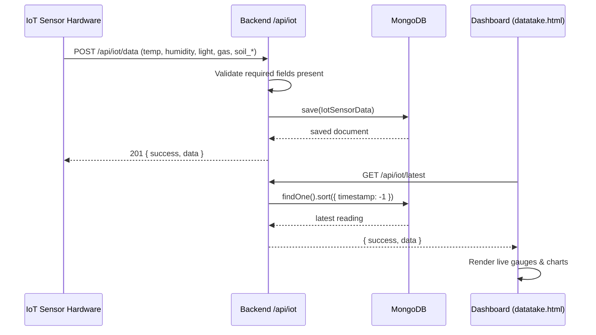
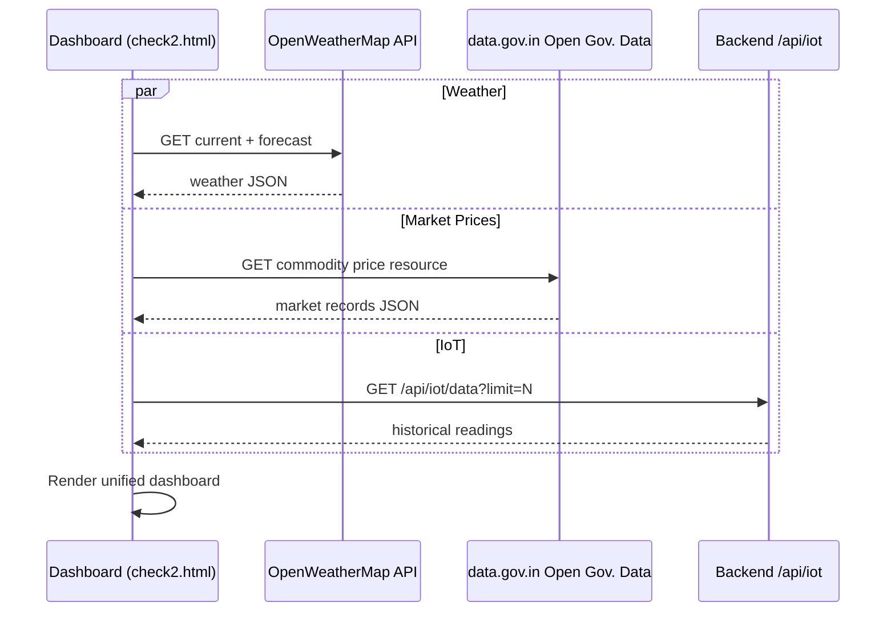

<div align="center">

# 🌾 KrishiMitra-AI

### *Krishi Mitra — "Farmer's Friend"*
### An integrated farm-tech platform bringing IoT soil sensing, farmer profiles, live weather & market data, and AI-assisted crop tools together in one place.

[](#-license)
[](https://github.com/ChandraBihariDas/KrishiMitra-AI/stargazers)
[](https://github.com/ChandraBihariDas/KrishiMitra-AI/network/members)
[](https://github.com/ChandraBihariDas/KrishiMitra-AI/issues)
[](https://github.com/ChandraBihariDas/KrishiMitra-AI/commits/main)
[](#)
[](#-contributing)

[](#)
[](#)
[](#)
[](#)
[](#)
[](#)

</div>

---

## 📸 Project Banner

> No `assets/banner.png` currently exists in the repository. Recommended location and placeholder:

```markdown

```

<sub>Drop a 1280×640 banner at `assets/banner.png` and this placeholder will render it automatically.</sub>

---

## 📑 Table of Contents

- [About the Project](#-about-the-project)
- [Features](#-features)
- [Tech Stack](#-tech-stack)
- [Architecture](#-architecture)
- [Folder Structure](#-folder-structure)
- [Installation](#-installation)
- [Environment Variables](#-environment-variables)
- [Screenshots](#-screenshots)
- [Usage Guide](#-usage-guide)
- [API Documentation](#-api-documentation)
- [Database](#-database)
- [AI Section](#-ai-section)
- [Workflow Diagrams](#-workflow-diagrams)
- [Performance Notes](#-performance-notes)
- [Security](#-security)
- [Deployment](#-deployment)
- [Contributing](#-contributing)
- [Roadmap](#-roadmap)
- [FAQ](#-faq)
- [License](#-license)
- [Acknowledgements](#-acknowledgements)
- [Author](#-author)

---

## 🧭 About the Project

**KrishiMitra-AI** ("Krishi" = agriculture, "Mitra" = friend, in Hindi) is a farm-tech web platform aimed at giving Indian farmers a single, mobile-friendly place to manage their farm profile, monitor real-time field conditions via IoT sensors, check weather and mandi (market) prices, and explore AI-assisted crop tools.

**What problem it solves:** Farmers today juggle multiple disconnected sources — a weather app, a mandi price board, word-of-mouth pest/soil advice, and paper records of past harvests. KrishiMitra-AI brings profile management, live field telemetry, and market/weather intelligence into one dashboard.

**Who it helps:** Smallholder and mid-size farmers, agricultural extension workers, and hackathon/demo audiences evaluating IoT-driven precision agriculture concepts.

**Why it was built:** To demonstrate how low-cost IoT sensors (soil moisture, pH, NPK, temperature, humidity, gas, light) can feed directly into a web dashboard farmers already use for profile and market data — with a roadmap toward full AI-driven recommendations.

**Major benefits:**
- One login for profile, live sensor data, and farm tools
- Real hardware-to-cloud IoT pipeline already working end-to-end
- Multi-language interface for regional accessibility
- Clear, honest groundwork for AI features (see [AI Section](#-ai-section)) to build on

> [!NOTE]
> This README was generated directly from a full analysis of the repository's actual code — nothing below is assumed or invented. Where a feature is still a UI prototype rather than a live/AI-backed feature, it's labeled as such.

---

## ✨ Features

### 🔐 Authentication
- Phone number + password registration and login (`/api/user`)
- Passwords hashed with **bcrypt**; sessions authenticated via **JWT**
- Client-side validation (10-digit phone, 8+ character password) before submit

### 🌐 Multi-language UI
- Login page ships full translations for **English, Hindi, Marathi, Tamil, Telugu, and Bengali**, switchable via a stored language preference

### 👤 Farmer Profiles
- Full CRUD (`/api/farmers`): create, search (with pagination + crop filter), fetch by ID or phone, update, delete
- Profile photo upload straight to **Cloudinary** (6MB limit, images only)
- Past-season history tracking (crop, year, yield)

### 🛰 IoT Integration (live)
- Dedicated ingestion endpoint (`/api/iot/data`) accepts real sensor telemetry: temperature, humidity, light, gas, soil temperature, soil moisture, soil pH, and soil NPK
- **IoT Sensor Dashboard** (`datatake.html`) and a combined **Deep Analysis Dashboard** (`check2.html`) render the latest/historical readings live via gauges and Chart.js graphs

### 🌦 Weather & 📈 Market Data (live, inside the Deep Analysis Dashboard)
- `check2.html` calls the **OpenWeatherMap API** directly for current conditions + forecast
- `check2.html` calls **data.gov.in's Open Government Data API** for real commodity market prices

### 🌾 Crop, Soil & Yield Tools (UI prototype today)
- Crop Yield Prediction, Soil Analysis, and Yield Optimization pages have fully built dashboards and charts — currently populated with **simulated/random demo values** rather than a trained model or live sensor tie-in (see [AI Section](#-ai-section))

### 🛒 Marketplace & 🏛 Subsidies
- `market.html` — product listing UI (no checkout wired up yet)
- `subsidies.html` — static informational content on government schemes

### 📱 Responsive, Multi-page UI
- Built with Bootstrap 5 and vanilla JavaScript; no framework/build step required for the frontend

### ☁ Cloud-backed Media
- All profile photos are served from Cloudinary's CDN rather than the app server

> [!TIP]
> Declared-but-not-yet-wired-up: **Razorpay** and **Stripe** SDKs and **node-cron** are present in `backend/package.json` but aren't imported anywhere in the codebase yet — they look like the intended foundation for payments and scheduled jobs. See [Roadmap](#-roadmap).

---

## 🛠 Tech Stack

### Frontend
| Technology | Purpose |
|---|---|
| HTML5 / CSS3 | Static multi-page structure |
| Bootstrap 5.3 (CDN) | Layout & UI components |
| Vanilla JavaScript | Page logic, form handling, API calls |
| Chart.js | Dashboard graphs (soil, yield, farm management, pest/soil pages) |
| Font Awesome | Iconography |

### Backend
| Technology | Purpose |
|---|---|
| Node.js | Runtime |
| Express 5 | REST API framework (ES Modules) |
| CORS | Cross-origin support |
| dotenv | Environment variable loading |
| nodemon | Dev auto-reload |

### Database
| Technology | Purpose |
|---|---|
| MongoDB | Primary datastore |
| Mongoose | ODM — schemas for users, profiles, IoT readings |

### AI / ML
| Technology | Purpose |
|---|---|
| — | No ML library, model file, or training pipeline is present in this repository today. Crop/soil/yield pages currently simulate output client-side. See [AI Section](#-ai-section). |

### External APIs
| API | Purpose |
|---|---|
| OpenWeatherMap | Current + forecast weather (used in the Deep Analysis Dashboard) |
| data.gov.in (Open Government Data) | Commodity/mandi market prices |

### Authentication
| Technology | Purpose |
|---|---|
| jsonwebtoken (JWT) | Issuing session tokens on login/register |
| bcrypt | Password hashing |
| validator | Phone number format validation |

### Deployment
| Technology | Purpose |
|---|---|
| Vercel (`vercel.json`) | Serverless deployment config included for the backend |
| Render | The live backend referenced by the frontend is hosted at `krishimitra-ai-wpik.onrender.com` |

### Developer Tools
| Technology | Purpose |
|---|---|
| Multer | In-memory file upload handling |
| Cloudinary SDK | Image storage/CDN |
| Git | Version control |

---

## 🏗 Architecture


---

## 📁 Folder Structure

<details>
<summary><strong>Click to expand full tree</strong></summary>

```
KrishiMitra-AI/
├── backend/
│   ├── config/
│   │   ├── cloudinary.js         # Cloudinary SDK configuration
│   │   └── mongodb.js            # MongoDB connection (Mongoose)
│   ├── controllers/
│   │   ├── profileController.js  # Farmer profile CRUD logic
│   │   └── userController.js     # Register / login logic
│   ├── middleware/
│   │   └── uploadToCloudinary.js # Multer -> Cloudinary upload handler
│   ├── models/
│   │   ├── IotSensorData.js      # IoT sensor reading schema
│   │   ├── profileModel.js       # Farmer profile schema
│   │   └── userModel.js          # User/auth schema
│   ├── routes/
│   │   ├── iotRoute.js           # /api/iot endpoints
│   │   ├── profileRoute.js       # /api/farmers endpoints
│   │   └── userRoute.js          # /api/user endpoints
│   ├── package.json
│   ├── package-lock.json
│   ├── server.js                 # Express app entry point
│   └── vercel.json               # Vercel serverless deployment config
├── frontend/
│   ├── images/                   # Static imagery used across pages
│   ├── about.html
│   ├── check2.html               # "Deep Analysis" dashboard — live IoT + weather + market
│   ├── contact.html
│   ├── crop_prediction.html      # Crop yield UI (currently simulated output)
│   ├── datatake.html             # IoT sensor dashboard (live)
│   ├── farm_management.html      # Task/calendar UI (client-side only, no persistence yet)
│   ├── forgot.html               # Forgot-password UI
│   ├── index.html                # Main landing page (byte-identical to test.html)
│   ├── irrigation.html           # "Coming soon" placeholder
│   ├── login.html / login.js     # Auth UI + logic (multi-language)
│   ├── market.html               # Marketplace product-listing UI
│   ├── market_price.html         # Market price UI (sample/demo data)
│   ├── next.html                 # Post-login dashboard hub (links to check2.html)
│   ├── pest_detection.html       # Currently mirrors soil_analysis.html's content
│   ├── profile.html              # Farmer profile UI (backend-connected)
│   ├── signup.html               # Registration UI (backend-connected)
│   ├── soil_analysis.html        # Soil analysis UI (simulated output)
│   ├── subsidies.html            # Government scheme info (static)
│   ├── test.html                 # Duplicate of index.html
│   ├── weather_forecast.html     # Standalone weather UI (simulated output)
│   └── yield.html                # Yield planning UI (simulated output)
└── .gitignore
```

</details>

**Notable structural points found during analysis:**
- `index.html` and `test.html` are byte-for-byte identical.
- `pest_detection.html` currently renders the same content as `soil_analysis.html` — pest detection isn't a distinct feature yet.
- There are two dashboard entry points: the main site (`index.html`) for auth/profile/tools, and a second flow (`next.html → check2.html` / `datatake.html`) for live IoT + weather + market data.
- No `.github/workflows`, `Dockerfile`, `requirements.txt`, or `LICENSE` file exist in the repository today.

---

## ⚙ Installation

### Prerequisites
- **Node.js v18+** (Express 5 requires it) and npm
- A **MongoDB** connection string (local or Atlas)
- A **Cloudinary** account (cloud name, API key, API secret)

### Steps

```bash
# 1. Clone the repository
git clone https://github.com/ChandraBihariDas/KrishiMitra-AI.git
cd KrishiMitra-AI

# 2. Install backend dependencies
cd backend
npm install

# 3. Configure environment variables
# create a .env file in backend/ — see Environment Variables section below

# 4. Run the backend
npm run server     # nodemon, auto-reload (development)
# or
npm start          # node server.js (production)
```

The API will start on `http://localhost:4000` by default (health check at `GET /`).

```bash
# 5. Serve the frontend (no build step — plain static files)
cd ../frontend
npx serve .
# or simply open frontend/index.html directly in a browser
```

> [!IMPORTANT]
> Several frontend files currently hardcode the **live Render URL** (`https://krishimitra-ai-wpik.onrender.com`) instead of reading it from config — this affects `login.js`, `signup.html`, `profile.html`, and `datatake.html`/`check2.html`. For local development against your own backend, update those URLs to `http://localhost:4000` (the config modal in `check2.html` already lets you override the IoT endpoint at runtime).

---

## 🔑 Environment Variables

Create `backend/.env` (the repository's `.gitignore` already excludes `*.env`):

```env
# Server
PORT=4000

# MongoDB
MONGODB_URI=mongodb+srv://<username>:<password>@<cluster-url>

# JWT
JWT_SECRET=<a-long-random-secret-string>

# Cloudinary (media storage)
CLOUDINARY_NAME=<your-cloudinary-cloud-name>
CLOUDINARY_API_KEY=<your-cloudinary-api-key>
CLOUDINARY_SECRET_KEY=<your-cloudinary-api-secret>
CLOUDINARY_FOLDER=farmers_profiles
```

| Variable | Required | Description |
|---|---|---|
| `PORT` | No (defaults to `4000`) | Port the Express server listens on |
| `MONGODB_URI` | **Yes** | MongoDB connection string; the app appends `/KrishiMitra-AI` as the database name |
| `JWT_SECRET` | **Yes** | Secret used to sign/verify login tokens |
| `CLOUDINARY_NAME` | **Yes** | Cloudinary cloud name |
| `CLOUDINARY_API_KEY` | **Yes** | Cloudinary API key |
| `CLOUDINARY_SECRET_KEY` | **Yes** | Cloudinary API secret |
| `CLOUDINARY_FOLDER` | No (defaults to `farmers_profiles`) | Cloudinary folder profile photos are uploaded into |

> [!WARNING]
> The live frontend (`check2.html`) currently has an **OpenWeatherMap API key hardcoded in client-side JavaScript**, and `check2.html` also calls data.gov.in with its publicly-documented sample key. Neither is read from an environment variable today. Since this is a public repository, treat the OpenWeatherMap key as compromised — rotate it and move weather/market calls behind the backend (reading the key from `.env`) rather than shipping it in the browser.

---

## 🖼 Screenshots

No screenshots currently exist in the repository. Recommended placeholders once captured:

| Page | Suggested path |
|---|---|
| Landing page | `docs/screenshots/home.png` |
| Login / Signup | `docs/screenshots/login.png` |
| Farmer Profile | `docs/screenshots/profile.png` |
| IoT Dashboard | `docs/screenshots/iot-dashboard.png` |
| Deep Analysis Dashboard (weather + market + IoT) | `docs/screenshots/dashboard.png` |
| Crop Prediction | `docs/screenshots/prediction.png` |
| Marketplace | `docs/screenshots/marketplace.png` |

```markdown


```

---

## 📖 Usage Guide

1. **Sign up** on `signup.html` with your name, 10-digit phone number, and a password (8+ characters).
2. **Log in** on `login.html` — choose your preferred language (English, Hindi, Marathi, Tamil, Telugu, or Bengali); on success you're redirected to `next.html`.
3. **Build your farmer profile** (`profile.html`): location, farm size, crops grown, bio, past-season yield history, and a profile photo (stored on Cloudinary).
4. **Connect IoT hardware** (optional): point your sensor device at `POST /api/iot/data` to start streaming temperature, humidity, light, gas, and soil readings into `datatake.html` / `check2.html`.
5. **Explore farm tools**: Crop Yield Prediction, Soil Analysis, Yield Optimization, Farm Management, Market Prices, Subsidies, and the Marketplace — note that the crop/soil/yield tools currently display illustrative demo output rather than live model predictions (see [AI Section](#-ai-section)).
6. **View the Deep Analysis Dashboard** (`check2.html`) for a single screen combining live IoT telemetry, live weather (OpenWeatherMap), and live market prices (data.gov.in).

---

## 🔌 API Documentation

### User

<details>
<summary><code>POST /api/user/register</code></summary>

| | |
|---|---|
| **Description** | Register a new farmer account |
| **Auth required** | No |
| **Request body** | `{ "name": "string", "phone_no": "9999999999", "password": "min 8 chars" }` |
| **Response (success)** | `{ "success": true, "token": "<jwt>" }` |
| **Response (failure)** | `{ "success": false, "message": "user already exists" }` |

</details>

<details>
<summary><code>POST /api/user/login</code></summary>

| | |
|---|---|
| **Description** | Log in with phone number + password |
| **Auth required** | No |
| **Request body** | `{ "phone_no": "9999999999", "password": "string" }` |
| **Response (success)** | `{ "success": true, "token": "<jwt>", "phone_no": "...", "username": "..." }` |
| **Response (failure)** | `{ "success": false, "message": "Invalid Credentials" }` |

</details>

### Farmer Profiles (`/api/farmers`)

| Method | Endpoint | Description | Auth |
|---|---|---|---|
| `POST` | `/api/farmers` | Create a profile (multipart, optional `photo` field) | None enforced |
| `GET` | `/api/farmers` | List profiles — query params `q`, `page`, `limit`, `crop` | None enforced |
| `GET` | `/api/farmers/phone/:phone` | Fetch a profile by phone number | None enforced |
| `GET` | `/api/farmers/:id` | Fetch a profile by Mongo ID | None enforced |
| `PUT` | `/api/farmers/:id` | Update a profile (multipart, optional new `photo`) | None enforced |
| `DELETE` | `/api/farmers/:id` | Delete a profile | None enforced |

<details>
<summary>Example — <code>GET /api/farmers?q=wheat&page=1&limit=25</code></summary>

```json
{
  "success": true,
  "meta": { "total": 1, "page": 1, "limit": 25, "pages": 1 },
  "data": [
    {
      "_id": "...",
      "name": "...",
      "phone": "...",
      "location": "...",
      "crops": "Wheat",
      "past": [{ "name": "Wheat", "year": "2025", "yield": "..." }]
    }
  ]
}
```

</details>

### IoT (`/api/iot`)

| Method | Endpoint | Description | Auth |
|---|---|---|---|
| `POST` | `/api/iot/data` | Ingest a sensor reading | None enforced |
| `GET` | `/api/iot/latest` | Get the most recent reading | None enforced |
| `GET` | `/api/iot/data?limit=N` | Get up to `N` historical readings (default 50) | None enforced |

<details>
<summary>Example — <code>POST /api/iot/data</code></summary>

**Request body** (all fields required):
```json
{
  "temp": 27.5,
  "humidity": 63,
  "light": 410,
  "gas": 120,
  "soil_temp": 24.1,
  "soil_moisture": 38,
  "soil_ph": 6.7,
  "soil_npk": 210
}
```

**Response:**
```json
{ "success": true, "message": "Data saved successfully", "data": { "...": "..." } }
```

</details>

> [!NOTE]
> None of the current routes enforce JWT verification server-side — a token is issued at login, but no middleware currently checks it on the profile or IoT endpoints. See [Security](#-security) and [Roadmap](#-roadmap).

---

## 🗄 Database

MongoDB via Mongoose, database name `KrishiMitra-AI`. Three collections:

**`users`**
| Field | Type | Notes |
|---|---|---|
| `name` | String | required |
| `phone_no` | Number | required, unique |
| `password` | String | required, bcrypt-hashed |
| `cartData` | Object | default `{}` |

**`profiles`**
| Field | Type | Notes |
|---|---|---|
| `name`, `phone`, `location` | String | required |
| `size`, `crops`, `bio` | String | optional |
| `past` | Array | `{ name, year, yield }` — season history |
| `photo`, `photo_public_id` | String | Cloudinary URL + public ID |
| `timestamps` | — | `createdAt` / `updatedAt` auto-managed |

**`iotsensordata`**
| Field | Type | Notes |
|---|---|---|
| `temp`, `humidity`, `light`, `gas` | Number | required |
| `soil_temp`, `soil_moisture`, `soil_ph`, `soil_npk` | Number | required |
| `nitrogen`, `phosphorus`, `potassium` | Number | required on the schema — see note below |
| `timestamp` | Date | defaults to `Date.now` |

**Relationships:** collections are independent (no `ref`/populate links) — `profiles` are matched to a farmer by `phone` at the application layer rather than a foreign key.

> [!NOTE]
> The `IotSensorData` schema requires `nitrogen`, `phosphorus`, and `potassium`, but the current `POST /api/iot/data` handler only reads `temp, humidity, light, gas, soil_temp, soil_moisture, soil_ph, soil_npk` from the request body — the three NPK-breakdown fields aren't currently being passed through from incoming sensor payloads. Flagged in [Roadmap](#-roadmap).

---

## 🤖 AI Section

**Current state (verified from code):** there is no ML model file, training script, or inference library anywhere in this repository. The three AI-flavored tools work like this today:

| Page | Current behavior |
|---|---|
| Crop Yield Prediction | `predictedYield = Math.random() * 20 + 35` — a randomized demo value |
| Soil Analysis | NPK and recommendation values are randomly generated in-browser |
| Yield Optimization & Planning | Chart data (uptake, water use, projections) is randomly generated in-browser |

**Intended purpose:** give farmers a fast, visual read on expected yield, soil nutrient status, and planning guidance — with the IoT sensor pipeline (already live) as the natural real-data input once a model is wired in.

**What's already in place to build on:**
- A working ingestion pipeline for real soil/environmental sensor data (`/api/iot`)
- A farmer profile with historical yield-by-crop-by-year data — a natural training feature set

**Not yet available:** training data/pipeline, a served model, or an accuracy figure — so none is claimed here. See [Roadmap](#-roadmap) for the natural next step (replacing the simulated outputs with a model trained on the IoT + profile history data already being collected).

---

## 🔄 Workflow Diagrams

**User Login**


**Crop Prediction (current implementation)**


**IoT Data Flow**


**Deep Analysis Dashboard (Weather + Market fetch)**


---

## ⚡ Performance Notes

Optimizations actually present in the codebase:
- `Profile.find()` list queries use `.lean()` for lighter-weight reads
- Pagination (`page`/`limit`, capped at 200 per page) on the profiles list endpoint
- Profile photos are offloaded to **Cloudinary's CDN** rather than served from the app
- Upload payloads capped (`multer` 6MB, JSON body limit `8mb`)

Not yet present: response caching, database indexes beyond MongoDB's default `_id`, or lazy-loading on the frontend — good candidates for the [Roadmap](#-roadmap).

---

## 🔒 Security

**In place:**
- Passwords hashed with **bcrypt** (salt rounds: 10) — never stored in plain text
- Session tokens signed with **JWT**
- Phone number format validated server-side with `validator`
- Upload middleware restricts file type (images only) and size (6MB)

**Recommended hardening (gaps found during analysis):**
- No route currently verifies the JWT on protected-feeling endpoints (`/api/farmers/*`, `/api/iot/*`) — a token is issued but not required
- `cors()` is enabled with no origin restriction
- No rate limiting is implemented on any endpoint
- A live OpenWeatherMap key is hardcoded in `frontend/check2.html` — rotate and move server-side
- No `LICENSE` file currently exists at the repository root

---

## 🚀 Deployment

**Backend**
- A `vercel.json` is included (Vercel serverless function targeting `server.js`)
- The frontend's hardcoded API calls point to a live instance on **Render**: `https://krishimitra-ai-wpik.onrender.com`

**Frontend**
- Pure static HTML/CSS/JS with no build step — deployable as-is to GitHub Pages, Netlify, Vercel (static), or Render's static site hosting. Just update the hardcoded backend URLs to match your deployed API first.

---

## 🤝 Contributing

Contributions are welcome!

1. Fork the repository
2. Create a feature branch: `git checkout -b feature/your-feature`
3. Commit your changes: `git commit -m "Add: your feature"`
4. Push to your branch: `git push origin feature/your-feature`
5. Open a Pull Request describing what changed and why

Please keep PRs focused and include context on which part of the app (backend route, model, or specific frontend page) your change touches.

---

## 🗺 Roadmap

- [ ] Replace simulated Crop Yield Prediction output with a real trained model
- [ ] Replace simulated Soil Analysis output with real computation/model
- [ ] Build a genuinely distinct Pest Detection feature (currently mirrors Soil Analysis)
- [ ] Ship the Irrigation Advice module (currently a "Coming Soon" placeholder)
- [ ] Wire Razorpay/Stripe into an actual marketplace checkout flow
- [ ] Wire up `node-cron` for scheduled jobs (e.g., periodic market-price refresh)
- [ ] Fix `POST /api/iot/data` to pass through `nitrogen`, `phosphorus`, `potassium` from the request body
- [ ] Enforce JWT verification on farmer-profile and IoT routes
- [ ] Move the hardcoded OpenWeatherMap key and API base URLs into environment/config
- [ ] Add rate limiting and a stricter CORS policy
- [ ] Add a `LICENSE` file
- [ ] Add automated tests and CI (GitHub Actions)
- [ ] Persist Farm Management tasks/calendar server-side (currently client-only)

---

## ❓ FAQ

**What is KrishiMitra-AI?**
A farm-tech web platform combining farmer profile management, live IoT soil/environment sensing, and weather/market data in one dashboard, with AI-assisted crop tools in progress.

**Do I need IoT hardware to use it?**
No — the IoT dashboard works with real sensors, but profile management, auth, and the demo crop/soil/yield tools work without any hardware.

**Are the crop prediction and soil analysis results real AI output right now?**
Not yet — they currently display randomized demo values. See the [AI Section](#-ai-section) for exactly what's implemented today.

**Which languages does the UI support?**
The login page currently supports English, Hindi, Marathi, Tamil, Telugu, and Bengali.

**How is my data stored?**
Profile and IoT data are stored in MongoDB; profile photos are stored on Cloudinary.

**Can I run my own instance?**
Yes — see [Installation](#-installation) and [Environment Variables](#-environment-variables).

---

## 📜 License

> [!WARNING]
> No `LICENSE` file currently exists in this repository. `backend/package.json` declares `"license": "ISC"`, but that field alone doesn't grant a license to the project as a whole. Consider adding an explicit `LICENSE` file (e.g. MIT) so contributors and users know exactly what they're permitted to do with the code.

---

## 🙏 Acknowledgements

- [Express](https://expressjs.com/) & [Node.js](https://nodejs.org/)
- [MongoDB](https://www.mongodb.com/) & [Mongoose](https://mongoosejs.com/)
- [Cloudinary](https://cloudinary.com/) for media storage
- [OpenWeatherMap](https://openweathermap.org/) for weather data
- [data.gov.in](https://data.gov.in/) — Open Government Data Platform India, for market price data
- [Bootstrap](https://getbootstrap.com/) & [Chart.js](https://www.chartjs.org/)
- [jsonwebtoken](https://github.com/auth0/node-jsonwebtoken), [bcrypt](https://github.com/kelektiv/node.bcrypt.js), [multer](https://github.com/expressjs/multer), [validator](https://github.com/validatorjs/validator.js)

---

## 👤 Author

<div align="center">


### Chandra Bihari Das

[](https://github.com/ChandraBihariDas)
[](https://github.com/ChandraBihariDas/KrishiMitra-AI)

</div>

---

<div align="center">

**⭐ If this project is useful to you, consider starring the repository!**

</div>
