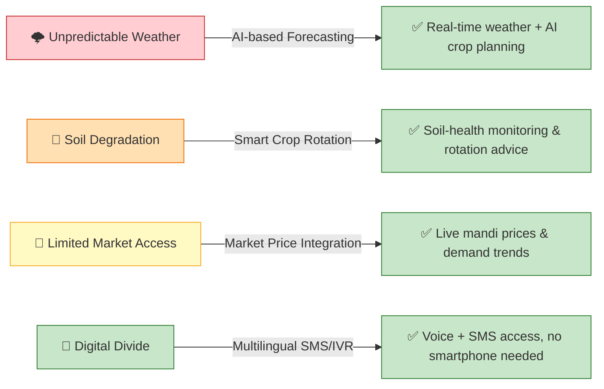
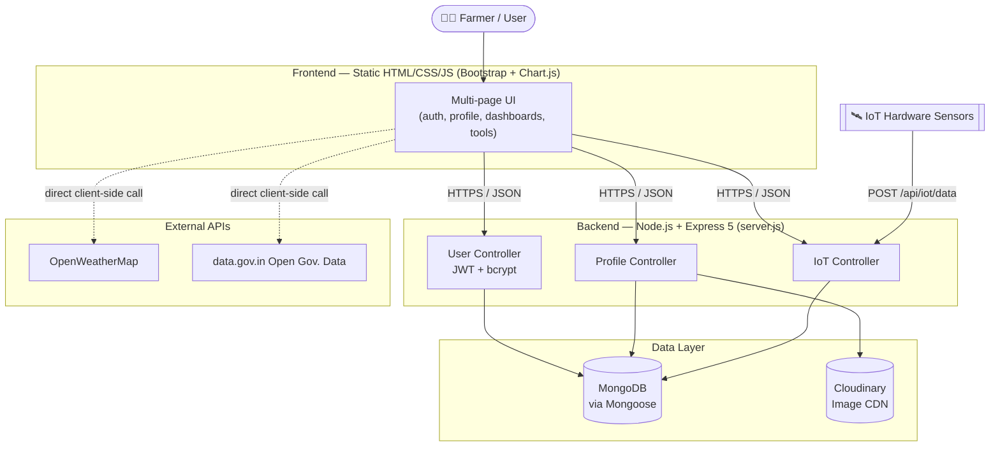
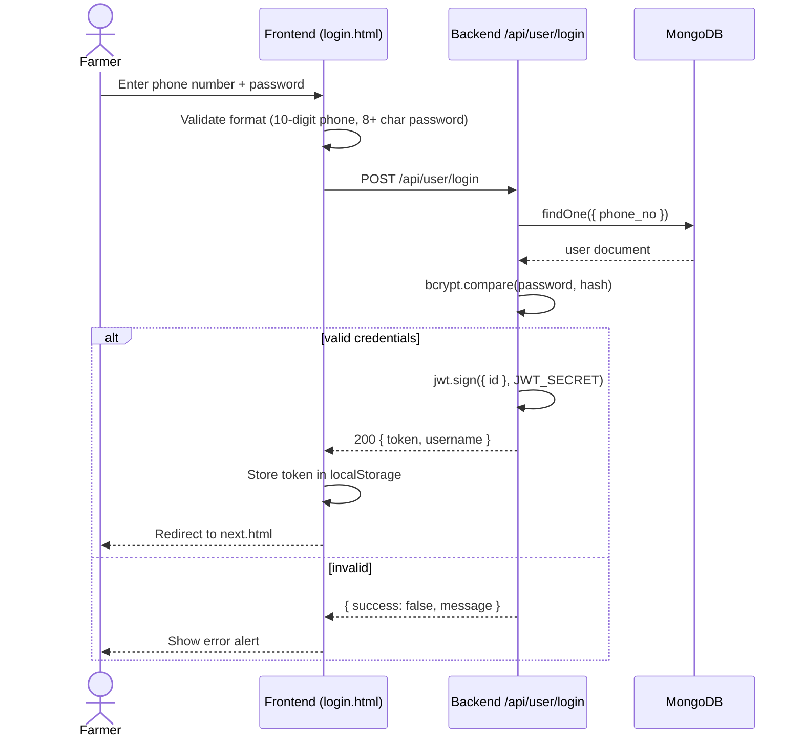
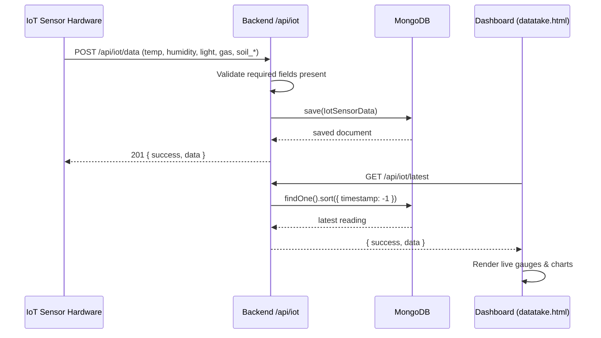
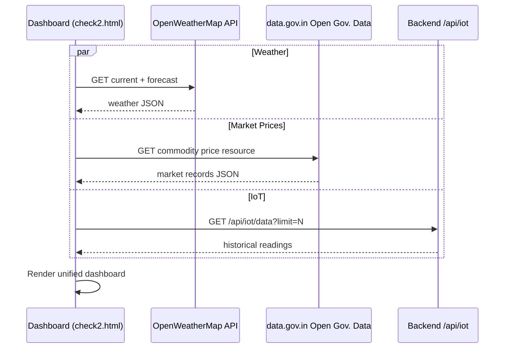
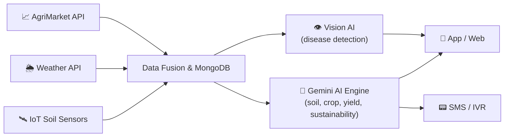
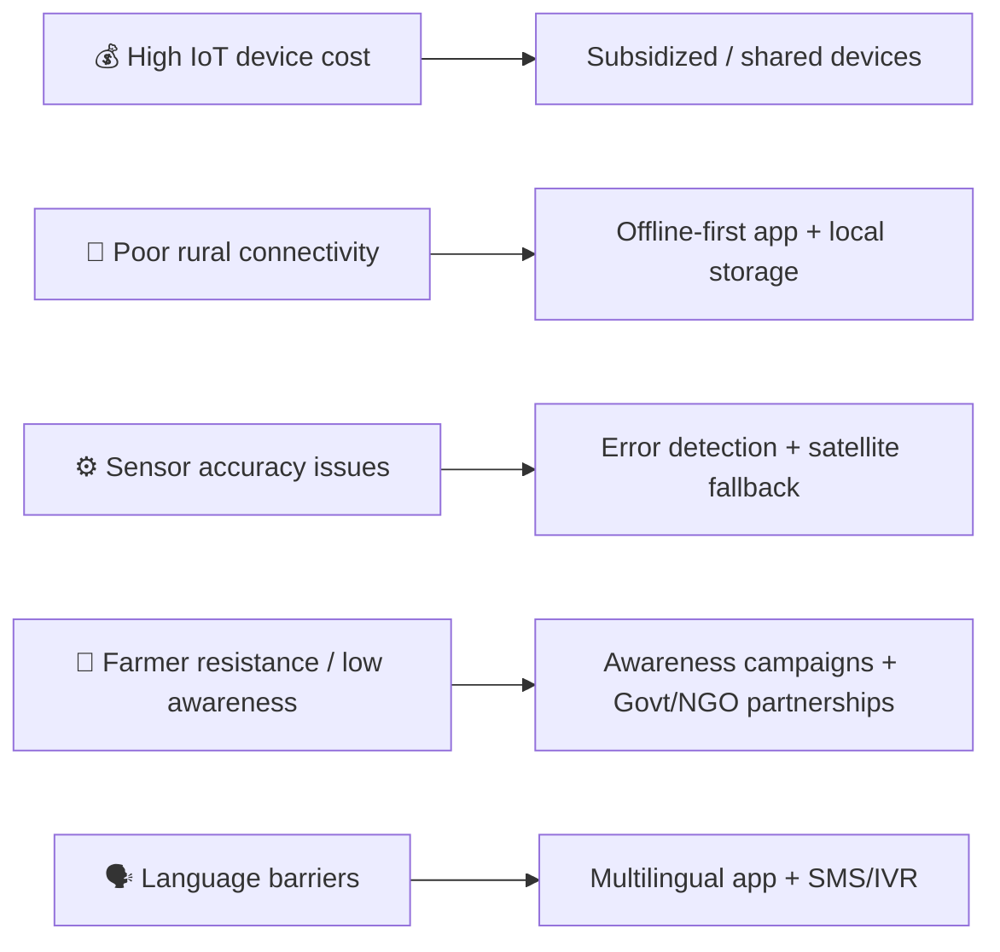

<div align="center">

<!-- Animated wave banner (auto-generated, no static asset needed) -->


<!-- Animated typing tagline -->
<a href="https://github.com/ChandraBihariDas/KrishiMitra-AI">
  
</a>

<br/>

<!-- Quick-access buttons -->
<a href="https://krishimitra-ai-app.vercel.app/"></a>
<a href="https://github.com/ChandraBihariDas/KrishiMitra-AI"></a>
<a href="#-installation"></a>

<br/><br/>

[](#-license)
[](https://github.com/ChandraBihariDas/KrishiMitra-AI/stargazers)
[](https://github.com/ChandraBihariDas/KrishiMitra-AI/network/members)
[](https://github.com/ChandraBihariDas/KrishiMitra-AI/issues)
[](https://github.com/ChandraBihariDas/KrishiMitra-AI/commits/main)
[](#)
[](#-contributing)


<br/>

[](#)
[](#)
[](#)
[](#)
[](#)
[](#)
[](https://krishimitra-ai-app.vercel.app/)

</div>

<div align="center">

</div>

---

<div align="center">

### 🏆 Smart India Hackathon 2025

| Field | Value |
|---|---|
| **Problem Statement ID** | 25044 |
| **Title** | AI-Powered Crop Yield Prediction and Optimization |
| **Theme** | Agriculture, FoodTech & Rural Development |
| **Category** | Software |
| **Team** | KrishiMitra-AI (Team ID 65681) |

</div>

---

## 📑 Table of Contents

<details open>
<summary>Click to expand / collapse</summary>

- [About the Project](#-about-the-project)
- [The Problem We're Solving](#-the-problem-were-solving)
- [Features](#-features)
- [Tech Stack](#-tech-stack)
- [Architecture](#-architecture)
- [Folder Structure](#-folder-structure)
- [Installation](#-installation)
- [Environment Variables](#-environment-variables)
- [Screenshots & Prototype](#-screenshots--prototype)
- [Usage Guide](#-usage-guide)
- [API Documentation](#-api-documentation)
- [Database](#-database)
- [AI Section — Honest Status](#-ai-section--honest-status)
- [Workflow Diagrams](#-workflow-diagrams)
- [Feasibility & Viability](#-feasibility--viability)
- [Impact & Benefits](#-impact--benefits)
- [Hardware Prototype](#-hardware-prototype)
- [Performance Notes](#-performance-notes)
- [Security](#-security)
- [Deployment](#-deployment)
- [Contributing](#-contributing)
- [Roadmap](#-roadmap)
- [FAQ](#-faq)
- [License](#-license)
- [Acknowledgements](#-acknowledgements)
- [Author](#-author)

</details>

---

## 🧭 About the Project

**KrishiMitra-AI** ("Krishi" = agriculture, "Mitra" = friend, in Hindi) is a farm-tech web platform built for **Smart India Hackathon 2025** that gives Indian farmers a single, mobile-friendly place to manage their farm profile, monitor real-time field conditions via IoT sensors, check weather and mandi (market) prices, and explore AI-assisted crop tools.

🔗 **Live App:** [krishimitra-ai-app.vercel.app](https://krishimitra-ai-app.vercel.app/)
🔗 **Source Code:** [github.com/ChandraBihariDas/KrishiMitra-AI](https://github.com/ChandraBihariDas/KrishiMitra-AI)

> **The problem:** Farmers today juggle multiple disconnected sources — a weather app, a mandi price board, word-of-mouth pest/soil advice, and paper records of past harvests. KrishiMitra-AI unifies profile management, live field telemetry, and market/weather intelligence into one dashboard, reachable even without a smartphone via SMS/IVR.

> [!NOTE]
> This README documents both the **hackathon vision/pitch** (multilingual voice, SMS/IVR, Gemini-AI crop engine, IoT hardware) and the **current working repository state** side by side. Where a pitched feature is still a UI prototype rather than a live/AI-backed one, it is clearly labeled so contributors know exactly what's implemented vs. planned.

<div align="center">

</div>

---

## 🌱 The Problem We're Solving

<div align="center">

| 🌩️ Core Problem | 🕳️ Information Gap | 💰 Market Disconnect | 📵 Technology Barrier |
|:---:|:---:|:---:|:---:|
| Unpredictable weather (sudden rains/droughts) increases crop-failure risk | No single trustworthy source for soil health, cropping patterns & forecasts | Farmers lack visibility into fair prices & the right buyers | Many farmers still lack smartphones or high-speed internet |

</div>

**KrishiMitra-AI's answer to each challenge:**



---

## ✨ Features

<table>
<tr>
<td width="50%" valign="top">

### 🔐 Authentication
- Phone number + password registration/login (`/api/user`)
- Passwords hashed with **bcrypt**; sessions via **JWT**
- Client-side validation (10-digit phone, 8+ char password)

### 🌐 Multi-language UI
- Login page ships full translations for **English, Hindi, Marathi, Tamil, Telugu & Bengali**

### 👤 Farmer Profiles
- Full CRUD (`/api/farmers`) — create, search + pagination + crop filter, fetch by ID/phone, update, delete
- Profile photo upload to **Cloudinary** (6MB limit, images only)
- Past-season history tracking (crop, year, yield)

### 🛰 IoT Integration *(live)*
- Ingestion endpoint (`/api/iot/data`) for temp, humidity, light, gas, soil temp/moisture/pH/NPK
- **IoT Sensor Dashboard** (`datatake.html`) + **Deep Analysis Dashboard** (`check2.html`) render live gauges & Chart.js graphs

</td>
<td width="50%" valign="top">

### 🌦 Weather & 📈 Market Data *(live)*
- `check2.html` calls **OpenWeatherMap** for current conditions + forecast
- `check2.html` calls **data.gov.in Open Government Data** for real mandi/commodity prices

### 🌾 Crop, Soil & Yield Tools *(UI prototype today)*
- Crop Yield Prediction, Soil Analysis & Yield Optimization have full dashboards/charts, currently on **simulated demo values** — see [AI Section](#-ai-section--honest-status)

### 🛒 Marketplace & 🏛 Subsidies
- `market.html` — product listing UI (checkout not wired up yet)
- `subsidies.html` — static info on government schemes

### 📱 Responsive UI
- Bootstrap 5 + vanilla JS — no build step required

### ☁ Cloud-backed Media
- Profile photos served from Cloudinary's CDN

</td>
</tr>
</table>

> [!TIP]
> **Declared-but-not-yet-wired-up:** `Razorpay`, `Stripe`, and `node-cron` are already dependencies in `backend/package.json` but aren't imported anywhere yet — they're the intended foundation for payments and scheduled jobs. See [Roadmap](#-roadmap).

> [!TIP]
> **Pitched vision (from the hackathon deck):** Gemini-AI powered chatbot with live audio, full SMS/IVR support, NVIDIA Jetson Nano + solar-powered hardware node with LoRa/GSM connectivity, and Deep Learning–based pest/disease detection from camera images. These represent the product's north star — see [Hardware Prototype](#-hardware-prototype) and [Roadmap](#-roadmap) for what's built vs. planned.

---

## 🛠 Tech Stack

<div align="center">

### Current Repository Stack

</div>

| Layer | Technology | Purpose |
|---|---|---|
| **Frontend** | HTML5, CSS3, Bootstrap 5.3 (CDN), Vanilla JS, Chart.js, Font Awesome | Multi-page UI, dashboards, graphs, icons |
| **Backend** | Node.js, Express 5 (ES Modules), CORS, dotenv, nodemon | REST API, env config, dev auto-reload |
| **Database** | MongoDB + Mongoose | Users, profiles, IoT readings |
| **Media** | Cloudinary SDK + Multer (in-memory) | Profile photo storage/CDN |
| **Auth** | jsonwebtoken (JWT), bcrypt, validator | Session tokens, password hashing, phone validation |
| **External APIs** | OpenWeatherMap, data.gov.in Open Gov. Data | Live weather + mandi market prices |
| **Deployment** | Vercel (`vercel.json`), Render (`krishimitra-ai-wpik.onrender.com`) | Serverless + live backend hosting |

<div align="center">

### 🧭 Pitched / Target Stack (Hackathon Vision)

</div>

| Layer | Planned Technology | Purpose |
|---|---|---|
| **AI/ML Core** | Gemini AI, TensorFlow, PyTorch | Crop recommendation, yield & soil-health prediction |
| **Computer Vision** | Deep Learning models | Real-time pest/disease detection from images |
| **Hardware** | NVIDIA Jetson Nano, 7-in-1 NPK sensor, DHT11, MQ-135, GSM SIM800A, LoRa, Solar charge controller | Field-deployable sensor node |
| **Connectivity** | SMS / Call / IVR system | Access for farmers without smartphones |
| **Infra** | AWS / Google Cloud | Scalable hosting |

> [!NOTE]
> No ML library, model file, or training pipeline exists in the repository **today** — the AI/ML row above reflects the hackathon roadmap, not shipped code. See [AI Section](#-ai-section--honest-status) for the honest, code-verified status.

---

## 🏗 Architecture



---

## 📁 Folder Structure

<details>
<summary><strong>📂 Click to expand full tree</strong></summary>

```
KrishiMitra-AI/
├── backend/
│   ├── config/
│   │   ├── cloudinary.js         # Cloudinary SDK configuration
│   │   └── mongodb.js            # MongoDB connection (Mongoose)
│   ├── controllers/
│   │   ├── profileController.js  # Farmer profile CRUD logic
│   │   └── userController.js     # Register / login logic
│   ├── middleware/
│   │   └── uploadToCloudinary.js # Multer -> Cloudinary upload handler
│   ├── models/
│   │   ├── IotSensorData.js      # IoT sensor reading schema
│   │   ├── profileModel.js       # Farmer profile schema
│   │   └── userModel.js          # User/auth schema
│   ├── routes/
│   │   ├── iotRoute.js           # /api/iot endpoints
│   │   ├── profileRoute.js       # /api/farmers endpoints
│   │   └── userRoute.js          # /api/user endpoints
│   ├── package.json
│   ├── package-lock.json
│   ├── server.js                 # Express app entry point
│   └── vercel.json               # Vercel serverless deployment config
├── frontend/
│   ├── images/                   # Static imagery used across pages
│   ├── about.html
│   ├── check2.html               # "Deep Analysis" dashboard — live IoT + weather + market
│   ├── contact.html
│   ├── crop_prediction.html      # Crop yield UI (currently simulated output)
│   ├── datatake.html             # IoT sensor dashboard (live)
│   ├── farm_management.html      # Task/calendar UI (client-side only, no persistence yet)
│   ├── forgot.html               # Forgot-password UI
│   ├── index.html                # Main landing page
│   ├── irrigation.html           # "Coming soon" placeholder
│   ├── login.html / login.js     # Auth UI + logic (multi-language)
│   ├── market.html               # Marketplace product-listing UI
│   ├── market_price.html         # Market price UI (sample/demo data)
│   ├── next.html                 # Post-login dashboard hub (links to check2.html)
│   ├── pest_detection.html       # Currently mirrors soil_analysis.html's content
│   ├── profile.html              # Farmer profile UI (backend-connected)
│   ├── signup.html               # Registration UI (backend-connected)
│   ├── soil_analysis.html        # Soil analysis UI (simulated output)
│   ├── subsidies.html            # Government scheme info (static)
│   ├── weather_forecast.html     # Standalone weather UI (simulated output)
│   └── yield.html                # Yield planning UI (simulated output)
└── .gitignore
```

</details>

**Notable structural points found during analysis:**
- `pest_detection.html` currently renders the same content as `soil_analysis.html` — pest detection isn't a distinct feature yet in the live repo (though it's a target Deep Learning feature in the pitch).
- Two dashboard entry points: the main site (`index.html`) for auth/profile/tools, and a second flow (`next.html → check2.html` / `datatake.html`) for live IoT + weather + market data.
- No `.github/workflows`, `Dockerfile`, `requirements.txt`, or `LICENSE` file exist in the repository today.

---

## ⚙ Installation

### Prerequisites
- **Node.js v18+** (Express 5 requires it) and npm
- A **MongoDB** connection string (local or Atlas)
- A **Cloudinary** account (cloud name, API key, API secret)

### Steps

```bash
# 1. Clone the repository
git clone https://github.com/ChandraBihariDas/KrishiMitra-AI.git
cd KrishiMitra-AI

# 2. Install backend dependencies
cd backend
npm install

# 3. Configure environment variables
# create a .env file in backend/ — see Environment Variables section below

# 4. Run the backend
npm run server     # nodemon, auto-reload (development)
# or
npm start          # node server.js (production)
```

The API will start on `http://localhost:4000` by default (health check at `GET /`).

```bash
# 5. Serve the frontend (no build step — plain static files)
cd ../frontend
npx serve .
# or simply open frontend/index.html directly in a browser
```

> [!IMPORTANT]
> Several frontend files currently hardcode the **live Render URL** (`https://krishimitra-ai-wpik.onrender.com`) instead of reading it from config — this affects `login.js`, `signup.html`, `profile.html`, and `datatake.html`/`check2.html`. For local development against your own backend, update those URLs to `http://localhost:4000` (the config modal in `check2.html` already lets you override the IoT endpoint at runtime).

> 💡 **Prefer one click?** The live, always-on version is already deployed at **[krishimitra-ai-app.vercel.app](https://krishimitra-ai-app.vercel.app/)** — no setup required to explore the UI.

---

## 🔑 Environment Variables

Create `backend/.env` (the repository's `.gitignore` already excludes `*.env`):

```env
# Server
PORT=4000

# MongoDB
MONGODB_URI=mongodb+srv://<username>:<password>@<cluster-url>

# JWT
JWT_SECRET=<a-long-random-secret-string>

# Cloudinary (media storage)
CLOUDINARY_NAME=<your-cloudinary-cloud-name>
CLOUDINARY_API_KEY=<your-cloudinary-api-key>
CLOUDINARY_SECRET_KEY=<your-cloudinary-api-secret>
CLOUDINARY_FOLDER=farmers_profiles
```

| Variable | Required | Description |
|---|:---:|---|
| `PORT` | No (defaults to `4000`) | Port the Express server listens on |
| `MONGODB_URI` | ✅ | MongoDB connection string; app appends `/KrishiMitra-AI` as the database name |
| `JWT_SECRET` | ✅ | Secret used to sign/verify login tokens |
| `CLOUDINARY_NAME` | ✅ | Cloudinary cloud name |
| `CLOUDINARY_API_KEY` | ✅ | Cloudinary API key |
| `CLOUDINARY_SECRET_KEY` | ✅ | Cloudinary API secret |
| `CLOUDINARY_FOLDER` | No (defaults to `farmers_profiles`) | Cloudinary folder profile photos are uploaded into |

> [!WARNING]
> The live frontend (`check2.html`) currently has an **OpenWeatherMap API key hardcoded in client-side JavaScript**, and also calls data.gov.in with its publicly-documented sample key. Neither is read from an environment variable today. Since this is a public repository, treat the OpenWeatherMap key as compromised — rotate it and move weather/market calls behind the backend (reading the key from `.env`) rather than shipping it in the browser.

---

## 🖼 Screenshots & Prototype

<div align="center">

**Login → Dashboard Flow**

*(from the SIH pitch deck prototype)*

| Login | Dashboard | Crop Prediction |
|:---:|:---:|:---:|
| Phone + password sign-in, multilingual | Feature-card hub: Crop Prediction, Weather, Market, Pest, Soil, Yield, Irrigation, Farm Mgmt | AgriStack-style yield predictor form |

</div>

Recommended screenshot locations once captured (repo currently has none):

| Page | Suggested path |
|---|---|
| Landing page | `docs/screenshots/home.png` |
| Login / Signup | `docs/screenshots/login.png` |
| Farmer Profile | `docs/screenshots/profile.png` |
| IoT Dashboard | `docs/screenshots/iot-dashboard.png` |
| Deep Analysis Dashboard | `docs/screenshots/dashboard.png` |
| Crop Prediction | `docs/screenshots/prediction.png` |
| Marketplace | `docs/screenshots/marketplace.png` |

```markdown


```

---

## 📖 Usage Guide

1. **Sign up** on `signup.html` with your name, 10-digit phone number, and a password (8+ characters).
2. **Log in** on `login.html` — choose your preferred language (English, Hindi, Marathi, Tamil, Telugu, or Bengali); on success you're redirected to `next.html`.
3. **Build your farmer profile** (`profile.html`): location, farm size, crops grown, bio, past-season yield history, and a profile photo (stored on Cloudinary).
4. **Connect IoT hardware** *(optional)*: point your sensor device at `POST /api/iot/data` to start streaming live readings into `datatake.html` / `check2.html`.
5. **Explore farm tools**: Crop Yield Prediction, Soil Analysis, Yield Optimization, Farm Management, Market Prices, Subsidies, and the Marketplace — note that the crop/soil/yield tools currently display illustrative demo output rather than live model predictions.
6. **View the Deep Analysis Dashboard** (`check2.html`) for a single screen combining live IoT telemetry, live weather, and live market prices.

---

## 🔌 API Documentation

### User

<details>
<summary><code>POST /api/user/register</code></summary>

| | |
|---|---|
| **Description** | Register a new farmer account |
| **Auth required** | No |
| **Request body** | `{ "name": "string", "phone_no": "9999999999", "password": "min 8 chars" }` |
| **Response (success)** | `{ "success": true, "token": "<jwt>" }` |
| **Response (failure)** | `{ "success": false, "message": "user already exists" }` |

</details>

<details>
<summary><code>POST /api/user/login</code></summary>

| | |
|---|---|
| **Description** | Log in with phone number + password |
| **Auth required** | No |
| **Request body** | `{ "phone_no": "9999999999", "password": "string" }` |
| **Response (success)** | `{ "success": true, "token": "<jwt>", "phone_no": "...", "username": "..." }` |
| **Response (failure)** | `{ "success": false, "message": "Invalid Credentials" }` |

</details>

### Farmer Profiles (`/api/farmers`)

| Method | Endpoint | Description | Auth |
|---|---|---|---|
| `POST` | `/api/farmers` | Create a profile (multipart, optional `photo` field) | None enforced |
| `GET` | `/api/farmers` | List profiles — query params `q`, `page`, `limit`, `crop` | None enforced |
| `GET` | `/api/farmers/phone/:phone` | Fetch a profile by phone number | None enforced |
| `GET` | `/api/farmers/:id` | Fetch a profile by Mongo ID | None enforced |
| `PUT` | `/api/farmers/:id` | Update a profile (multipart, optional new `photo`) | None enforced |
| `DELETE` | `/api/farmers/:id` | Delete a profile | None enforced |

<details>
<summary>Example — <code>GET /api/farmers?q=wheat&page=1&limit=25</code></summary>

```json
{
  "success": true,
  "meta": { "total": 1, "page": 1, "limit": 25, "pages": 1 },
  "data": [
    {
      "_id": "...",
      "name": "...",
      "phone": "...",
      "location": "...",
      "crops": "Wheat",
      "past": [{ "name": "Wheat", "year": "2025", "yield": "..." }]
    }
  ]
}
```

</details>

### IoT (`/api/iot`)

| Method | Endpoint | Description | Auth |
|---|---|---|---|
| `POST` | `/api/iot/data` | Ingest a sensor reading | None enforced |
| `GET` | `/api/iot/latest` | Get the most recent reading | None enforced |
| `GET` | `/api/iot/data?limit=N` | Get up to `N` historical readings (default 50) | None enforced |

<details>
<summary>Example — <code>POST /api/iot/data</code></summary>

**Request body** (all fields required):
```json
{
  "temp": 27.5,
  "humidity": 63,
  "light": 410,
  "gas": 120,
  "soil_temp": 24.1,
  "soil_moisture": 38,
  "soil_ph": 6.7,
  "soil_npk": 210
}
```

**Response:**
```json
{ "success": true, "message": "Data saved successfully", "data": { "...": "..." } }
```

</details>

> [!NOTE]
> None of the current routes enforce JWT verification server-side — a token is issued at login, but no middleware currently checks it on the profile or IoT endpoints. See [Security](#-security) and [Roadmap](#-roadmap).

---

## 🗄 Database

MongoDB via Mongoose, database name `KrishiMitra-AI`. Three collections:

**`users`**
| Field | Type | Notes |
|---|---|---|
| `name` | String | required |
| `phone_no` | Number | required, unique |
| `password` | String | required, bcrypt-hashed |
| `cartData` | Object | default `{}` |

**`profiles`**
| Field | Type | Notes |
|---|---|---|
| `name`, `phone`, `location` | String | required |
| `size`, `crops`, `bio` | String | optional |
| `past` | Array | `{ name, year, yield }` — season history |
| `photo`, `photo_public_id` | String | Cloudinary URL + public ID |
| `timestamps` | — | `createdAt` / `updatedAt` auto-managed |

**`iotsensordata`**
| Field | Type | Notes |
|---|---|---|
| `temp`, `humidity`, `light`, `gas` | Number | required |
| `soil_temp`, `soil_moisture`, `soil_ph`, `soil_npk` | Number | required |
| `nitrogen`, `phosphorus`, `potassium` | Number | required on the schema — see note below |
| `timestamp` | Date | defaults to `Date.now` |

**Relationships:** collections are independent (no `ref`/populate links) — `profiles` are matched to a farmer by `phone` at the application layer.

> [!NOTE]
> The `IotSensorData` schema requires `nitrogen`, `phosphorus`, and `potassium`, but the current `POST /api/iot/data` handler only reads `temp, humidity, light, gas, soil_temp, soil_moisture, soil_ph, soil_npk` — the NPK-breakdown fields aren't currently passed through from incoming sensor payloads. Flagged in [Roadmap](#-roadmap).

---

## 🤖 AI Section — Honest Status

**Current state (verified from code):** there is no ML model file, training script, or inference library anywhere in this repository. The three AI-flavored tools work like this today:

| Page | Current behavior |
|---|---|
| Crop Yield Prediction | `predictedYield = Math.random() * 20 + 35` — a randomized demo value |
| Soil Analysis | NPK and recommendation values are randomly generated in-browser |
| Yield Optimization & Planning | Chart data (uptake, water use, projections) is randomly generated in-browser |

**Hackathon vision (per the pitch deck):** a **Gemini AI**-powered core engine performing predictive analysis on IoT + profile + market data, with a separate **Vision AI / Deep Learning** model for real-time pest and disease detection from camera images, all delivered through a live audio chat interface.

**What's already in place to build on:**
- A working ingestion pipeline for real soil/environmental sensor data (`/api/iot`)
- A farmer profile with historical yield-by-crop-by-year data — a natural training feature set
- Two research references identified for the modeling approach:
  - *Integrating Climate Management and Remote Sensing Data for Crop Yield Estimation with Multimodal Vision Transformers*
  - *Multimodal Data Fusion and Deep Ensemble Learning for Accurate Crop Yield Prediction*

**Not yet available:** training data/pipeline, a served model, or an accuracy figure — so none is claimed here. See [Roadmap](#-roadmap) for the natural next step (replacing simulated outputs with a model trained on the IoT + profile history data already being collected).

---

## 🔄 Workflow Diagrams

**User Login**


**IoT Data Flow**


**Deep Analysis Dashboard (Weather + Market fetch)**


**Pitched Full-Stack Data Pipeline (Vision)**


---

## 📊 Feasibility & Viability

<div align="center">

| Dimension | Highlights |
|---|---|
| **Technical** | IoT sensors (pH, fertility, moisture) · Weather APIs (IMD, OpenWeather) · AI models tested in agriculture (Gemini, TensorFlow, PyTorch) · Multilingual + offline app support |
| **Economical** | Low-cost IoT hardware · Cloud/API freemium tiers · Higher farmer income via better crop choices · Govt subsidies & partnerships |
| **Operational** | Simple local-language app (text & voice) · Auto-collected soil/weather/market data · Farmers just view recommendations & act |

</div>

**Market opportunity:** India has ~150M farmers (≈65.4% classified as marginal farmers per the 2015–16 Agriculture Census), with the AgriTech market projected to reach **$34B by 2027**. Even 1% penetration (~1.5M farmers) at a ₹50/month subscription represents ≈₹900 Cr (~$110M/year) in potential revenue.

**Key risks & mitigations:**



---

## 🌾 Impact & Benefits

<table>
<tr>
<td width="50%" valign="top">

**💰 Economic Impact**
- Higher income via better yields/market prices
- Reduced input costs (fertilizer, pesticides, seeds)
- Better margins by cutting wastage

**🤝 Social Impact**
- Improved lifestyle & living standards
- Builds confidence and decision-making power
- Enhances community collaboration & knowledge sharing

</td>
<td width="50%" valign="top">

**🌍 Environmental Impact**
- Reduces harmful chemical use
- Improves soil health, water conservation & biodiversity
- Promotes sustainable farming

**💡 Technological & Educational Impact**
- Access to modern AI tools, sensors, automation
- Precision farming (right crop, right time, right quantity)
- Digital literacy & data-driven decision-making

</td>
</tr>
</table>

---

## 🔧 Hardware Prototype

*(from the pitch deck — target field hardware, not part of the current web repo)*

The pitched hardware node centers on an **NVIDIA Jetson Nano** collecting readings from a 7-in-1 NPK sensor, DHT temp/humidity sensors, MQ-135 air-quality sensor, sunlight, wind and rain sensors, plus a connected camera for AI-based pest recognition. Data is compiled and sent over **LoRa** to a cloud sync layer, with a **GSM SIM800A** module handling SMS alerts to farmers when sensor thresholds are met. The whole unit is designed to run off a **solar charge controller** for field deployment without grid power.

---

## ⚡ Performance Notes

Optimizations actually present in the codebase:
- `Profile.find()` list queries use `.lean()` for lighter-weight reads
- Pagination (`page`/`limit`, capped at 200 per page) on the profiles list endpoint
- Profile photos offloaded to **Cloudinary's CDN** rather than served from the app
- Upload payloads capped (`multer` 6MB, JSON body limit `8mb`)

Not yet present: response caching, database indexes beyond MongoDB's default `_id`, or lazy-loading on the frontend — good candidates for the [Roadmap](#-roadmap).

---

## 🔒 Security

**In place:**
- Passwords hashed with **bcrypt** (salt rounds: 10) — never stored in plain text
- Session tokens signed with **JWT**
- Phone number format validated server-side with `validator`
- Upload middleware restricts file type (images only) and size (6MB)

**Recommended hardening (gaps found during analysis):**
- No route currently verifies the JWT on protected-feeling endpoints (`/api/farmers/*`, `/api/iot/*`) — a token is issued but not required
- `cors()` is enabled with no origin restriction
- No rate limiting is implemented on any endpoint
- A live OpenWeatherMap key is hardcoded in `frontend/check2.html` — rotate and move server-side
- No `LICENSE` file currently exists at the repository root

---

## 🚀 Deployment

<div align="center">

| Environment | URL |
|---|---|
| 🌐 **Live App (production)** | [krishimitra-ai-app.vercel.app](https://krishimitra-ai-app.vercel.app/) |
| 🔧 **Backend (Render)** | `krishimitra-ai-wpik.onrender.com` |
| 📂 **Source Repository** | [github.com/ChandraBihariDas/KrishiMitra-AI](https://github.com/ChandraBihariDas/KrishiMitra-AI) |

</div>

**Backend**
- A `vercel.json` is included (Vercel serverless function targeting `server.js`)
- The frontend's hardcoded API calls also point to a live instance on **Render**

**Frontend**
- Pure static HTML/CSS/JS with no build step — deployable as-is to GitHub Pages, Netlify, Vercel (static), or Render's static site hosting. Just update the hardcoded backend URLs to match your deployed API first.

---

## 🤝 Contributing

Contributions are welcome!

1. Fork the repository
2. Create a feature branch: `git checkout -b feature/your-feature`
3. Commit your changes: `git commit -m "Add: your feature"`
4. Push to your branch: `git push origin feature/your-feature`
5. Open a Pull Request describing what changed and why

Please keep PRs focused and include context on which part of the app (backend route, model, or specific frontend page) your change touches.

---

## 🗺 Roadmap

- [ ] Replace simulated Crop Yield Prediction output with a real trained model
- [ ] Replace simulated Soil Analysis output with real computation/model
- [ ] Build a genuinely distinct Pest Detection feature using Vision AI (currently mirrors Soil Analysis)
- [ ] Ship the Irrigation Advice module (currently a "Coming Soon" placeholder)
- [ ] Integrate Gemini AI as the core recommendation engine (per pitch)
- [ ] Wire Razorpay/Stripe into an actual marketplace checkout flow
- [ ] Wire up `node-cron` for scheduled jobs (e.g., periodic market-price refresh)
- [ ] Fix `POST /api/iot/data` to pass through `nitrogen`, `phosphorus`, `potassium` from the request body
- [ ] Enforce JWT verification on farmer-profile and IoT routes
- [ ] Move the hardcoded OpenWeatherMap key and API base URLs into environment/config
- [ ] Add rate limiting and a stricter CORS policy
- [ ] Add SMS/IVR delivery channel for non-smartphone users
- [ ] Deploy the Jetson Nano hardware node prototype to a live field test
- [ ] Add a `LICENSE` file
- [ ] Add automated tests and CI (GitHub Actions)
- [ ] Persist Farm Management tasks/calendar server-side (currently client-only)

---

## ❓ FAQ

<details>
<summary><b>What is KrishiMitra-AI?</b></summary>
<br/>
A farm-tech web platform combining farmer profile management, live IoT soil/environment sensing, and weather/market data in one dashboard, with AI-assisted crop tools in progress. Built for Smart India Hackathon 2025.
</details>

<details>
<summary><b>Do I need IoT hardware to use it?</b></summary>
<br/>
No — the IoT dashboard works with real sensors, but profile management, auth, and the demo crop/soil/yield tools work without any hardware.
</details>

<details>
<summary><b>Are the crop prediction and soil analysis results real AI output right now?</b></summary>
<br/>
Not yet — they currently display randomized demo values. See the <a href="#-ai-section--honest-status">AI Section</a> for exactly what's implemented today vs. what's on the roadmap.
</details>

<details>
<summary><b>Which languages does the UI support?</b></summary>
<br/>
The login page currently supports English, Hindi, Marathi, Tamil, Telugu, and Bengali.
</details>

<details>
<summary><b>How is my data stored?</b></summary>
<br/>
Profile and IoT data are stored in MongoDB; profile photos are stored on Cloudinary.
</details>

<details>
<summary><b>Can I try it without installing anything?</b></summary>
<br/>
Yes — visit the live deployment at <a href="https://krishimitra-ai-app.vercel.app/">krishimitra-ai-app.vercel.app</a>.
</details>

<details>
<summary><b>Can I run my own instance?</b></summary>
<br/>
Yes — see <a href="#-installation">Installation</a> and <a href="#-environment-variables">Environment Variables</a>.
</details>

---

## 📜 License

> [!WARNING]
> No `LICENSE` file currently exists in this repository. `backend/package.json` declares `"license": "ISC"`, but that field alone doesn't grant a license to the project as a whole. Consider adding an explicit `LICENSE` file (e.g. MIT) so contributors and users know exactly what they're permitted to do with the code.

---

## 🙏 Acknowledgements

- [Express](https://expressjs.com/) & [Node.js](https://nodejs.org/)
- [MongoDB](https://www.mongodb.com/) & [Mongoose](https://mongoosejs.com/)
- [Cloudinary](https://cloudinary.com/) for media storage
- [OpenWeatherMap](https://openweathermap.org/) for weather data
- [data.gov.in](https://data.gov.in/) — Open Government Data Platform India, for market price data
- [Bootstrap](https://getbootstrap.com/) & [Chart.js](https://www.chartjs.org/)
- [jsonwebtoken](https://github.com/auth0/node-jsonwebtoken), [bcrypt](https://github.com/kelektiv/node.bcrypt.js), [multer](https://github.com/expressjs/multer), [validator](https://github.com/validatorjs/validator.js)
- Smart India Hackathon 2025 organizing committee

---

## 👤 Author

<div align="center">


### Chandra Bihari Das

[](https://github.com/ChandraBihariDas)
[](https://github.com/ChandraBihariDas/KrishiMitra-AI)
[](https://krishimitra-ai-app.vercel.app/)

</div>

---

<div align="center">

**⭐ If this project is useful to you, consider starring the repository!**


</div>
